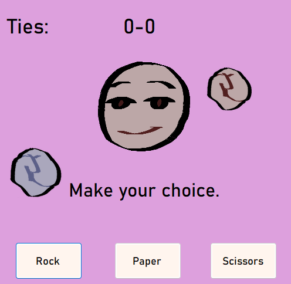
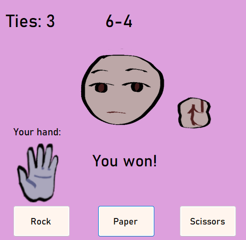
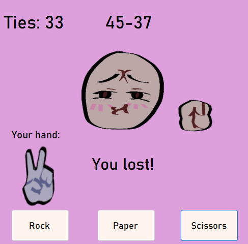

# Rock Paper Scissors

Eine einfache Desktop Anwendung, die das klassische Spiel **Schere, Stein, Papier** grafisch simuliert. Entwickelt mit **C#** und **.NET**, zeigt dieses Projekt grundlegende Spiellogik, Benutzerwahl und zufallsbasierte Entscheidungen.




Die eigene Hand, der Gegner und die Hand des Gegners werden grafisch dargestellt und die aktuellen Züge werden nach jeder Runde abgebildet.




Je nach dem, welches Ergebnis nach einer Runde entstanden ist, ändert sich die Grimasse des Gegeners.




Falls drei Mal in Folge die gleichen Ergebnisse geschehen, dann ändert sich die Grimasse des Gegners noch einmal. 

---

## 🛠️ Technologien

- **Sprache:** C#
- **Framework:** .NET 4.7.2 (oder höher)
- **Entwicklungsumgebung:** Visual Studio

---

## 🚀 Funktionen

- Spieler tritt gegen den Computer an
- Zufällige Wahl des Computers durch `Random`
- Logik zur Ermittlung des Spielausgangs
- Änderung der Grimasse des Gegners anhand des Ergebnisses
- Unendliches Spiel 
- Einfache Bedienung und Benutzeroberfläche

---

## 🔧 Installation & Ausführung

### Schritte

1. Repository klonen:
   ```bash
   git clone https://github.com/PPahl04/RockPaperScissors.git
   cd RockPaperScissors

2. Anwendung starten
    ```bash
    dotnet build
    "Rock Paper Scissors App\bin\Debug\Rock Paper Scissors App.exe"
